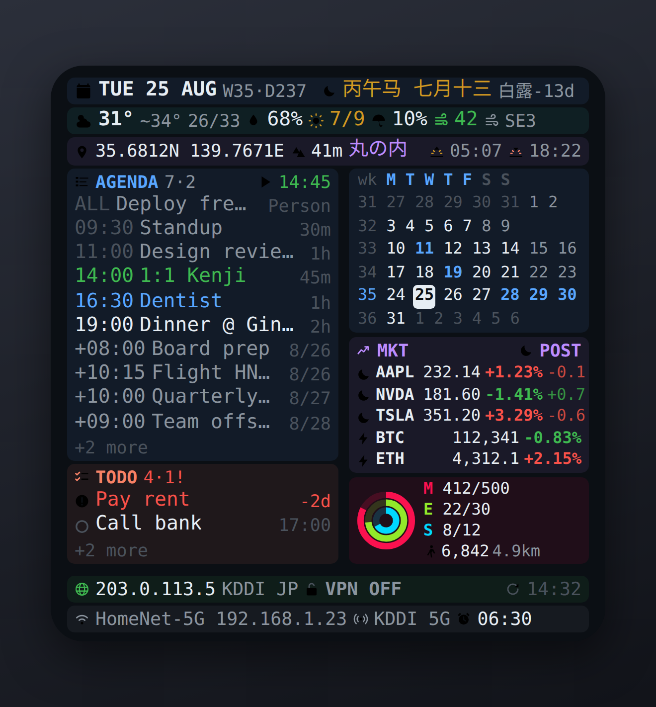

# GeekBoard · Scriptable 大号 Widget

极客风高信息密度面板。一屏塞进日程、提醒、农历节气、天气、空气质量、经纬度海拔、月历、股票与加密货币行情（含盘前盘后）、活动圆环、网络与 VPN 状态。



> 预览图为模拟数据，展示的是 430×932 机型（372×386 pt）的**盘后**状态；实机使用 SF Mono 与真实 SF Symbols，观感一致。

## 目录

- [布局与图例](#布局与图例)
- [安装](#安装)
- [配置](#配置)
- [行情：盘前 / 盘中 / 盘后 / 休市](#行情盘前--盘中--盘后--休市)
- [尺寸自适应](#尺寸自适应)
- [快捷指令桥接](#快捷指令桥接)
- [省电](#省电)
- [数据源与失效行为](#数据源与失效行为)
- [iOS 拿不到的东西](#ios-拿不到的东西)
- [排错](#排错)

## 布局与图例

从上到下七个区块，每块有自己的低饱和底色，用来划分边界：

| 区块 | 底色 | 内容 |
|---|---|---|
| 日期 | 蓝 | 周几 · 日 · 月 / ISO 周号 · 年内第几天 / 干支生肖 · 农历 / 下一个节气倒数（当天则直接显示节气名，橙色） |
| 天气 | 青 | 天气图标 · 当前温度 / 体感（与实温差 ≥2° 才显示）/ 今日低-高 / 湿度 / UV 当前÷今日峰值 / 降水概率 / AQI / 风向风速 |
| 地理 | 紫 | 经纬度 / 海拔 / 所在区 / 日出 · 日落 |
| AGENDA | 蓝 | 今天的日程；行数有余量时自动往后填未来几天（`AGENDA_DAYS`，默认 7 天），未来的事以 `+` 前缀、右侧显示日期而不是时长。正在进行的显示结束时间，否则显示下一个的实时倒计时 |
| TODO | 橙 | 未完成提醒，逾期与高优先级标红并显示逾期天数。**一条都没有时整个区块不占位**，行数全给日程 |
| 月历 | 蓝 | ISO 周号 + 当月网格，有日程的日期加粗变蓝，今天反白 |
| MKT | 随时段变色 | 行情，见下节 |
| 活动 | 洋红 | 三圆环 + 步数 / 距离（需要快捷指令桥接） |
| 底栏 | 绿 / 灰 | 公网 IP · 运营商 · VPN 判定 · Gmail 未读 · 脚本上次运行时间 ／ WiFi 名 · 内网 IP · 数据 SIM · 制式 · 闹钟 |

**颜色是语义，不是装饰：**

| 颜色 | 含义 |
|---|---|
| 绿 | 正在进行的日程、盘中、空气优良 |
| 蓝 | 下一个日程、有事件的日期、湿度、所在区 |
| 红 | 逾期 / 高优先级 / 涨（可切换） |
| 橙 | 今天正好是节气、TODO 区块、日落 |
| 琥珀 | VPN ON、UV 偏高、数据过期告警、盘前 |
| 紫 | 盘后、定位 |
| 灰 | 已过去 / 休市 / 次要信息 |

涨跌默认**红涨绿跌**，改 `CN_COLOR_CONVENTION: false` 切换为绿涨红跌。

**图标**全部用 SF Symbols。脚本对每个符号做了存在性检查——旧版 iOS 上缺失的符号会自动退回文字标签（例如 `aqi.medium` 缺失时显示 `AQI`），不会崩。不想要图标就设 `SHOW_ICONS: false`，退化成纯文字版。不想要区块底色就设 `SHOW_SECTION_TINT: false`。

## 安装

1. App Store 安装 **Scriptable**。
2. 把 `GeekBoard.js` 放进 iCloud Drive → `Scriptable` 文件夹（或在 App 内新建脚本粘贴内容，命名 `GeekBoard`）。
3. 在 Scriptable 内运行一次，按提示授予 **日历 / 提醒事项 / 定位** 权限。
4. 桌面长按 → 添加小组件 → Scriptable → **大号** → 长按小组件 → 编辑 → Script 选 `GeekBoard`，When Interacting 选 `Run Script`。
5. 设置 → Scriptable → 位置 → 选 **始终**（后台刷新时才能定位；脚本用公里级精度 + 30 分钟缓存，耗电可忽略）。

## 配置

全部在脚本顶部 `CONFIG` 里。

| 项 | 说明 |
|---|---|
| `STOCKS` | Yahoo 代码：美股 `AAPL`；港股 `0700.HK`；A 股 `600519.SS` / `000001.SZ`；日股 `7203.T`；指数 `^GSPC` `^N225`；汇率 `USDJPY=X` |
| `CRYPTO` | Binance 现货代码（自动加 USDT）。Binance 不通时切 CoinGecko，映射见 `CRYPTO_GECKO_IDS` |
| `QUOTE_ROWS` | 行情总行数，股票在前币在后 |
| `EXTENDED_HOURS` | `true` 取盘前/盘后（每只股票 1 次请求）；`false` 用批量接口（总共 1 次请求，但没有盘前盘后） |
| `CN_COLOR_CONVENTION` | 红涨绿跌 / 绿涨红跌 |
| `CALENDARS` / `CALENDARS_EXCLUDE` | 按日历名称过滤 |
| `REMINDER_LISTS` | 指定提醒列表名。留空 = 所有列表里 7 天内到期 + 逾期；指定后无日期的项也会显示 |
| `TRUSTED_ISP` | 填你家宽带和手机运营商名字片段，如 `["KDDI","SoftBank","NTT"]`。出口 IP 不属于这些 → 判定 VPN ON。留空则只靠 ip-api 的机房/代理标记 |
| `GMAIL` | 填 Google 应用专用密码（账号 → 安全性 → 两步验证 → 应用专用密码）即可显示未读数，走 Atom feed，一次请求 |
| `SIZE_OVERRIDE` | 尺寸推算不准时手动指定，如 `{ w: 372, h: 364 }`，量法见下节 |
| `AGENDA_DAYS` | 日程最多往后看几天，默认 7 |
| `RIGHT_RATIO` | 右栏占宽比例，默认 `0.46`。日程标题老被截断就调小 |
| `SHOW_ICONS` / `SHOW_SECTION_TINT` | 图标 / 区块底色开关 |
| `SHOW_PRESSURE` | 第三行加气压 hPa（地名短的时候放得下） |
| `USE_GPS` | `false` 则完全不定位，用 `FALLBACK_COORDS` |
| `TTL` / `TTL_QUOTES` | 各数据源缓存分钟数 |
| `BLOCK_PAD_V` | 区块上下内边距（在 CONFIG 下方）。调大更松散，但会吃掉左栏行数 |

## 行情：盘前 / 盘中 / 盘后 / 休市

数据取自 Yahoo 的 chart 接口，响应里的 `currentTradingPeriod` 给出了该交易所当日 pre / regular / post 三段的起止时间戳，所以时段是**本地算出来的，不额外发请求**。

每行左侧的图标就是该标的当前所处的时段：

| 时段 | 图标 | 颜色 | 显示的价格与百分比 |
|---|---|---|---|
| 盘中 OPEN | ● 实心圆 | 绿 | 现价 + 当日涨跌幅 |
| 未知 UNKNOWN | ○ 空心圆 | 灰 | 接口没给交易时段时如实显示未知，不假装盘中 |
| 盘前 PRE | ☀ 日出 | 琥珀 | **盘前价** + 相对前收的涨跌幅 |
| 盘后 POST | ☾ 月亮 | 紫 | 收盘价 + 当日涨跌幅，**再附一个盘后变动**（第二个百分数，1 位小数） |
| 休市 CLOSED | ⏸ 暂停 | 灰 | 最后收盘价 + 当日涨跌幅，**整行灰显**，涨跌色也降饱和 |
| 加密货币 | ⚡ 闪电 | 青 | 现价 + 24h 涨跌幅（7×24 无时段概念） |

MKT 区块标题右侧还会用文字重复一遍当前时段（`OPEN` / `PRE` / `POST` / `CLOSED`），区块底色也跟着变——休市时整块转灰，扫一眼就知道数字是不是活的。

标题上的时段取第一只股票所在交易所；如果你同时放了美股和港股，各行的图标仍然是各自正确的。

## 尺寸自适应

Scriptable 读不到 Widget 的实际尺寸，只能从屏幕推。在 430×932 的机器上实测，大号 Widget 是 **372×386 pt**（截图里深色圆角矩形占 x 89..1204、y 253..1411，3 倍图）。流传的旧尺寸表写 364×382，窄了 8pt。

用实测标定的比例推算：

```
宽 = 屏宽 × 0.8651        高 = 宽 × 1.0384
```

> **量的时候一定要取靠近中线的那一行/那一列。** 贴着边缘量会落进圆角里，两头各少算一截——我第一次就是在离左边缘 11px 的位置量的，把 386 量成了 364，结果整个中间空出一大块。

| 屏幕 | 机型 | Widget | 主字号 | 左栏行数 | 月历字号 |
|---|---|---|---|---|---|
| 440×956 | 16 Pro Max | 381×396 | 13.5 | 16 | 11.0 |
| 430×932 | 15/16 Pro Max, 15/16 Plus | 372×386 | 13.2 | 16 | 10.6 |
| 402×874 | 16 Pro | 348×361 | 12.3 | 15 | 9.8 |
| 393×852 | 14 Pro, 15, 15 Pro, 16 | 340×353 | 12.0 | 15 | 9.5 |
| 375×812 | X, XS, 11 Pro, 12/13 mini | 324×336 | 11.4 | 15 | 8.9 |
| 320×568 | SE1 | 277×288 | 10.5 | 14 | 7.9 |

（行数与月历字号是「有桥接」时的值；没有桥接时活动区块只占一行，行数各 +1、月历字号更大。）

右栏三块（月历 / 行情 / 活动）要一起塞进同一份高度，行情和活动的行数是定的，所以**富余量折算成月历字号**——空间紧就把月历缩小，而不是撑爆。实在塞不下（比如 SE1）才减行情行数，最少保留 2 行。月历字号同时受宽度约束：8 列 × 2 个等宽字符必须塞进右栏宽度。

可用行数是**渲染时**算的，不是启动时。因为「有没有桥接」决定底栏是一行还是两行，「有没有提醒事项」决定 TODO 区块占不占位，这两件事都要等数据回来才知道；按最坏情况预留会白白浪费一行多。

**要是你的机器对不上**，截个桌面图量一下 Widget 深色圆角矩形的像素宽高，除以屏幕缩放倍数（Pro 机型是 3），填进 `SIZE_OVERRIDE: { w: 372, h: 364 }` 即可。

## 快捷指令桥接

iOS 不让第三方 App 读健康数据、WiFi 名、内网 IP、SIM 信息，但「快捷指令」可以。原理：一个快捷指令把这些写成 JSON 到 iCloud 的 Scriptable 目录，Widget 每次刷新读它。

### 新建快捷指令 `GeekBoard Bridge`

按顺序添加动作：

1. **查找健康样本**（类型 `活动能量`，筛选 `开始日期 是 今天`）→ **计算统计**（总和）→ 命名 `move`
2. 同上，类型 `锻炼时间` → `exercise`
3. 同上，类型 `站立小时数` → `stand`
4. 同上，类型 `步数` → `steps`
5. 同上，类型 `步行 + 跑步距离` → `distance`（若返回米，接一个「计算 ÷1000」，脚本按 km 显示）
6. **获取网络详细信息**（Wi-Fi → 网络名称）→ `ssid`
7. **获取当前 IP 地址**（本地, Wi-Fi）→ `lanIp`
8. **获取网络详细信息**（蜂窝 → 运营商名称）→ `carrier`；再来一个（蜂窝 → 无线技术）→ `radio`
9. （可选，iOS 17+）**获取闹钟** → 筛选「已启用」→ 按时间排序 → 取第一项 → **设定格式** 成 `HH:mm` → `alarm`。搜不到这个动作就跳过。
10. **文本**，内容如下（`{…}` 换成上面各步的变量，**全部加引号**，脚本会自己去掉单位和千分位逗号）：

```json
{"move":"{move}","exercise":"{exercise}","stand":"{stand}","steps":"{steps}","distance":"{distance}",
 "ssid":"{ssid}","lanIp":"{lanIp}","carrier":"{carrier}","radio":"{radio}","alarm":"{alarm}"}
```

11. **存储文件**：服务 `iCloud Drive`，关闭「询问存储位置」，路径 `Scriptable/geekboard-bridge.json`，打开「如果文件存在则覆盖」。

跑一次，去「文件」App 确认 iCloud Drive/Scriptable/ 下有 `geekboard-bridge.json`。样例见 [`geekboard-bridge.sample.json`](geekboard-bridge.sample.json)。

圆环目标快捷指令拿不到，在 CONFIG 里手填 `MOVE_GOAL` 等；或在 JSON 里加 `"moveGoal":"500"` 覆盖。

### 自动化

快捷指令 → 自动化 → 新建个人自动化，每条都选 **立即运行** 并关掉「运行时通知」：

- **特定时间**：7:00 / 9:00 / 12:00 / 15:00 / 18:00 / 21:00 / 23:00 各建一条（iOS 不支持「每小时」）
- **App**：`健身` 关闭时
- **充电器**：连接时
- **Wi-Fi**：加入任意网络时（换网时刷新 SSID / 内网 IP）

全部指向 `GeekBoard Bridge`。桥接数据超过 `BRIDGE_STALE_HOURS`（默认 4 小时）没更新，相关字段会灰显并在底栏标 `stale Nh`。

## 省电

- 刷新时机由 iOS 决定（通常 15~30 分钟一次），`REFRESH_MIN` 只是给系统的建议值。
- 冷启动最多 7 个网络请求（3 股票 + 币 + 天气 + AQI + IP），之后全部走 TTL 缓存。
- **行情缓存随交易时段自动伸缩**：盘中 5 分钟、盘前盘后 15 分钟、休市 **120 分钟**。夜里和周末基本不发行情请求。
- 定位公里级精度 + 30 分钟缓存，不做持续定位。
- 无动画、无大图、无后台常驻。整体功耗与系统自带天气 Widget 同一量级。

缓存热之后，距上次刷新 N 分钟时实际发出的请求数（实测，非估算）：

| 时段 | +0m | +6m | +25m | +65m | +130m |
|---|---|---|---|---|---|
| 盘中 OPEN | 0 | 3 | 5 | 7 | 7 |
| 盘后 POST | 0 | 0 | 5 | 7 | 7 |
| 休市 CLOSED | 0 | 0 | **2** | **4** | 7 |

按 iOS 常见的 15~30 分钟刷新节奏，盘中每次 3~5 个请求，休市时只有 2 个（天气 + 币）。这张表可以自己复现：

```bash
rm -f /tmp/c.json
CACHE=/tmp/c.json SESSION=CLOSED node tools/mock_run.js        # 冷启动，填满缓存
CACHE=/tmp/c.json SESSION=CLOSED SKEW=25 node tools/mock_run.js  # 25 分钟后再刷一次
```

嫌请求还是多就把 `EXTENDED_HOURS` 设成 `false`——所有股票合并成 1 次请求（冷启动共 5 个），代价是没有盘前盘后数据。

## 数据源与失效行为

| 数据 | 来源 | 失败时 |
|---|---|---|
| 天气 / 日出日落 / UV / 气压 | Open-Meteo（免 key） | 用上次缓存并标 ⚠；没缓存显示 `weather unavailable` |
| AQI | Open-Meteo Air Quality | 不显示 |
| 股票 | Yahoo chart（含 `includePrePost`），失败回退 spark 批量接口 | 缓存 + `cached HH:mm`；接口没给交易时段则显示 UNKNOWN 而非假装盘中 |
| 加密货币 | Binance 24hr → CoinGecko 兜底 | 同上 |
| 公网 IP / ISP / VPN | ip-api.com（含机房/代理标记）→ ipapi.co 兜底 | 显示 `offline` |
| 农历 / 节气 | 脚本内置 2000–2100 精确表（天文历法生成，逐日校验） | 无网络依赖 |
| 三圆环 / 步数 / WiFi / SIM / 闹钟 | 快捷指令桥接文件 | 显示 `no bridge` |

## iOS 拿不到的东西

微信未读、短信未读、耳机电量、指南针朝向、网关地址。任何第三方 App（包括快捷指令）都读不到，Widget 里不放假数据占位。

电池也移除了——iPhone 状态栏右上角本来就一直显示，重复即无效信息。

## 排错

| 现象 | 原因 / 处理 |
|---|---|
| 一片空白或只剩一行 | 某个权限没给。在 Scriptable 内运行一次看控制台报错 |
| 行情全是 `--` | Yahoo 偶尔限流，等几分钟；或代码写错（去 Yahoo 网页确认） |
| 经纬度灰色 | 定位失败，正在用 `FALLBACK_COORDS`。检查 Scriptable 定位权限是否为「始终」 |
| 圆环不显示 | 确认 iCloud Drive/Scriptable/geekboard-bridge.json 存在且是合法 JSON（所有值都加引号） |
| 内容偏窄 / 右边留白，或底栏被裁 | 尺寸推算与你的机型有出入。截图量一下填 `SIZE_OVERRIDE`，见「尺寸自适应」 |
| 月历的数字非常小甚至看不清 | 老版本的 bug：格子是「固定宽度 + 两个弹性 spacer 夹文字」，spacer 会优先抢宽度，把带 `minimumScaleFactor` 的文字压到 1~2pt。已改成不设固定宽度、格子里不放 spacer，靠等宽字体对齐 |
| 行情图标全是绿点、MKT 右边没有时段标签 | 旧版脚本写的缓存里没有 `session` 字段。已加缓存 schema 版本号，升级后会自动丢弃旧缓存 |
| 日程标题截断太多 | 调小 `RIGHT_RATIO`（如 0.42） |
| 图标显示成文字 | 该 SF Symbol 在你的 iOS 版本里不存在，这是预期的回退行为 |

## 本地开发

改布局前先在电脑上跑一遍，比传手机上试快得多：

```bash
node tools/mock_run.js                      # 默认盘中
SESSION=POST node tools/mock_run.js         # 盘后
SESSION=CLOSED SCREEN=320x568 node tools/mock_run.js   # 休市 + SE1
OFFLINE=1 NOLOC=1 EMPTY=1 BRIDGE=0 node tools/mock_run.js   # 全部数据源失效
NOSYM=1 node tools/mock_run.js              # 所有 SF Symbol 缺失，验证文字回退
LIGHT=1 node tools/mock_run.js              # 清闲的一天（日程少、TODO 为 0），验证不会留空白
NOPERIOD=1 node tools/mock_run.js           # Yahoo 不给交易时段，必须显示 UNKNOWN
STALECACHE=1 node tools/mock_run.js         # 用旧 schema 的缓存喂它，必须丢弃重取
CACHE=/tmp/c.json SKEW=25 node tools/mock_run.js       # 持久化缓存 + 拨快时钟，验证 TTL
```

`tools/mock_run.js` 模拟了 Scriptable 运行时（含 `Device.screenSize`、`SFSymbol`、日历、提醒、网络），打印文本版的 Widget 树并在末尾报告实际发出的请求数。
`tools/preview.html` 是预览图的 HTML 源，`tools/gen_lunar.py` 用于重新生成农历表（需 `pip install sxtwl`）。
